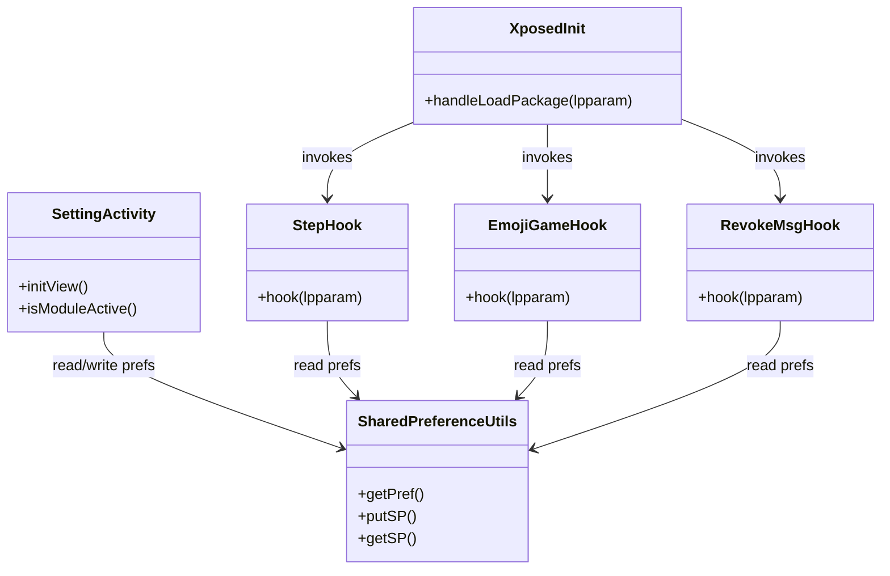
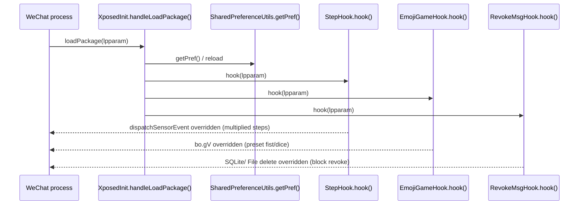

## 1. 🦅 全局鹰眼 (The High-Level View)
- **一句话定义**：这是一个基于 Xposed 的 Android 插件，用 Kotlin Hook 微信等 App，加入步数倍增、猜拳/骰子作弊、防撤回、红包监听等功能。
- **核心解决问题**：在目标 App 运行时截获关键方法，按用户配置即时改写返回值或副作用，让微信表现出“增强”效果。
- **架构模式判别**：事件驱动的插件式架构——收到包加载事件后按模块注册 Hook；UI 与 Hook 通过 SharedPreferences 键值弱耦合。

## 2. 🗺️ 静态架构地图 (Structure & Components)
- **关键目录树**
    ```
    app/src/main/java/com/coderpig/cpwechatxposed/
    ├── XposedInit.kt                 // Xposed 入口，按包名初始化各 Hook
    ├── App.kt                        // Application 级初始化
    ├── Constants.kt                  // 全部偏好键与默认值
    ├── hook/                         // 业务 Hook 模块
    │   ├── StepHook.kt               // 传感器步数倍增
    │   ├── EmojiGameHook.kt         // 猜拳/骰子结果预设
    │   ├── RevokeMsgHook.kt         // 消息防撤回，拦截 DB/文件删除
    │   └── RedPacketHook.kt         // 红包/转账调试与日志（保留示例）
    ├── ui/                           // 配置 UI
    │   └── SettingActivity.kt       // 复选/输入控件写入偏好
    └── utils/
        ├── SharedPreferenceUtils.kt // 读写 SharedPreferences、开放权限
        └── Ext.kt                   // 通用扩展（Toast、日志等）
    ```

- **核心类/模块关系图**


## 3. 🚦 动态链路追踪 (The Critical Path)
- **场景描述**：微信进程被加载后，入口根据包名拉起偏好配置，按顺序注册步数、猜拳/骰子、防撤回等 Hook；这些 Hook 在对应方法被调用时改写数据，使前端看到被“加工”的结果。

- **时序图**


- **代码导游**
    1. **入口 (Entry)**: `XposedInit.handleLoadPackage` 在包名匹配微信时执行，载入 `XSharedPreferences` 并调用各 `hook(...)`。（`app/src/main/java/com/coderpig/cpwechatxposed/XposedInit.kt`）
    2. **处理 (Process)**:
       - `StepHook.hook` Hook `SystemSensorManager$SensorEventQueue.dispatchSensorEvent`，按倍数改写步数。（`app/src/main/java/com/coderpig/cpwechatxposed/hook/StepHook.kt`）
       - `EmojiGameHook.hook` Hook `com.tencent.mm.sdk.platformtools.bo.gV`，返回预设拳/点数。（`app/src/main/java/com/coderpig/cpwechatxposed/hook/EmojiGameHook.kt`）
       - `RevokeMsgHook.hook` 拦截 `SQLiteDatabase.updateWithOnConflict/delete` 和 `File.delete`，阻断撤回并替换内容。（`app/src/main/java/com/coderpig/cpwechatxposed/hook/RevokeMsgHook.kt`）
    3. **出口 (Exit)**: Hook 方法直接修改返回值或阻断删除，效果在微信界面实时体现，无额外返回链路。

## 4. 🧩 关键抽象与扩展点 (Key Abstractions)
- **核心接口/基类**
  - `IXposedHookLoadPackage` 的实现 `XposedInit`：唯一入口，集中注册所有 Hook。
  - `SharedPreferenceUtils`/`XPrefs`：封装可写的偏好访问，保证 Xposed 进程能读取用户设置。

- **插件/中间件机制**
  - 新增 Hook：在 `hook/` 下新增文件并在 `XposedInit.handleLoadPackage` 中调用 `NewHook.hook(lpparam)`。
  - 新增配置：在 `Constants.kt` 增加键；`SettingActivity` 增加控件与读写；Hook 中通过 `SharedPreferenceUtils.getSP/putSP` 使用。

## 5. ⚠️ 专家锦囊 (Architect's Notes)
- **隐藏的复杂度**
  - 防撤回同时拦截数据库更新、删除及文件删除，逻辑分散且依赖多个偏好开关，需要按微信版本验证字段名。
  - `setWorldReadable` 直接改偏好文件权限，高版本 Android 可能受限，导致 Xposed 读取失败。

- **依赖陷阱**
  - 强依赖 Xposed API 与微信内部类签名（如 `bo.gV`、`SensorEventQueue.dispatchSensorEvent`），微信版本升级可能需要重新定位方法。
  - 运行需 root/启用 Xposed，非该环境下插件不会生效。
